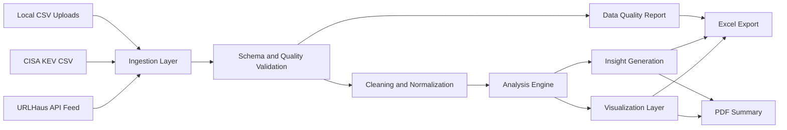

# Threat Data Pipeline

A production-style cybersecurity analytics pipeline built in Python for real-world threat intelligence data.

This project ingests live data from URLHaus and CISA Known Exploited Vulnerabilities (KEV), handles malformed CSV edge cases commonly seen in public feeds, validates and cleans multi-source datasets, detects trends and anomalies, and exports analyst-ready Excel and PDF reports.

## Why This Project Stands Out

- Uses real threat-intelligence sources instead of toy data
- Handles messy production-style CSV problems: latin-1 encoding, top-of-file comments, malformed rows, broken quotes, and Excel export edge cases
- Separates ingestion, validation, cleaning, analysis, visualization, and reporting into modular layers
- Produces outputs that feel operationally useful, not just academically correct
- Includes tests for schema inference, missing-value handling, and outlier detection

## Showcase Summary

This pipeline was designed like a lightweight security analytics system rather than a one-off script.

- URLHaus feed ingestion supports API-key authentication through `.env`
- CISA KEV ingestion pulls directly from the maintained GitHub CSV source
- Multi-source records are merged with source lineage preserved
- Data quality issues are surfaced before and after cleaning
- Trend and anomaly outputs are turned into plain-English analyst summaries
- Results are exported as Excel and PDF deliverables suitable for review or demo

## Demo Command

```bash
python -m threat_data_pipeline.cli --urlhaus --kev --output-dir output
```

Example result shape:

```json
{
  "rows": 15965,
  "columns": 17,
  "executive_summary": "The combined threat-intelligence dataset contains 4,842 records. URLHaus contributed 3,290 cleaned URL records. CISA KEV contributed 1,552 exploited-vulnerability records. The most frequently affected KEV vendor is Microsoft with 362 entries. An activity spike was detected on 2022-03-03 in dateAdded with 95 observations. Observed daily activity in dateAdded has decreased by 43.4% in the most recent period versus the earlier baseline."
}
```

Generated outputs:

- `output/threat_intelligence_report.xlsx`
- `output/threat_intelligence_summary.pdf`
- `output/charts/*.png`
- `output/pipeline.log`

## Architecture



Core modules:

- `ingestion.py`: local/API/URL CSV ingestion with size checks, encoding fallback, comment skipping, and malformed-row recovery
- `validation.py`: schema inference, missing-value checks, duplicates, inconsistencies, and outlier detection
- `cleaning.py`: null handling, categorical normalization, date standardization, URL normalization, and transformation logging
- `analysis.py`: summary statistics, correlations, segmentation, trend detection, anomaly detection, and executive-summary generation
- `visualization.py`: chart generation for severity, timelines, anomaly highlights, and edge-case datasets
- `reporting.py`: Excel and PDF export logic with Excel-safe sanitization
- `pipeline.py`: orchestration layer that keeps business logic separate from any future UI or scheduler

## Engineering Challenges Solved

This is the part I would highlight in a showcase, code walkthrough, or interview:

- URLHaus encoding issues: the ingestion path now tries UTF-8 first and falls back to latin-1 when needed
- Comment-prefixed CSV feeds: URLHaus comment lines beginning with `#` are ignored safely
- Broken public feed rows: the parser falls back from pandas' C engine to the Python engine, then to literal-quote mode for malformed quoting
- Source traceability: merged records retain source metadata so downstream analytics stay explainable
- Excel export failures: illegal worksheet characters and timezone-aware datetimes are sanitized before workbook generation
- Mixed-source narratives: the executive summary now distinguishes URLHaus URL activity from KEV vulnerability activity

## Features

- Multi-source ingestion for local CSVs, URLHaus, and CISA KEV in the same run
- `.env`-based secret loading with `python-dotenv`
- File type and file size validation
- Encoding detection and fallback handling
- Malformed-row recovery without crashing the pipeline
- Schema inference for numeric, categorical, date, and URL columns
- Duplicate detection, missing-value reporting, and numeric outlier detection
- Configurable missing-value strategies for numeric and categorical data
- URL, categorical, and date normalization with transformation logging
- Summary statistics, correlation analysis, segmentations, and timeline anomaly detection
- Plain-English executive summary with recommended analyst next steps
- Export to Excel and PDF with embedded charts and supporting tables
- Filtering by date range, threat category, and status

## Setup

### PowerShell

```powershell
python -m venv .venv
.venv\Scripts\Activate.ps1
pip install -e .[dev]
Copy-Item .env.example .env
```

### Git Bash

```bash
python -m venv .venv
source .venv/Scripts/activate
pip install -e '.[dev]'
cp .env.example .env
```

Add your environment variables to `.env`:

```dotenv
URLHAUS_API_KEY=your_urlhaus_auth_key
CISA_KEV_URL=https://raw.githubusercontent.com/cisagov/kev-data/develop/known_exploited_vulnerabilities.csv
```

## Usage

Run both live feeds:

```bash
python -m threat_data_pipeline.cli --urlhaus --kev --output-dir output
```

Run live feeds plus local CSV uploads:

```bash
python -m threat_data_pipeline.cli --urlhaus --kev --input-csv ./samples/internal_feed.csv --output-dir output
```

Run filtered analysis:

```bash
python -m threat_data_pipeline.cli --urlhaus --kev --start-date 2026-01-01 --end-date 2026-03-01 --threat-category phishing --status-filter active --output-dir output
```

## Reliability And Edge Cases

- Empty datasets return a safe executive summary instead of crashing
- Single-column datasets still generate a fallback distribution chart
- Oversized or non-CSV inputs fail with explicit messages
- Missing URLHaus credentials fail fast with a targeted `.env` error
- Sparse numeric datasets skip invalid correlations and outlier math
- Optional charts are created only when the required columns exist
- Quality-report and export stages tolerate malformed source rows

## Testing

```bash
pytest
```

Current automated coverage includes:

- schema inference
- missing-value handling
- outlier detection
- latin-1 fallback handling
- malformed quoted-row recovery

## Scaling To Enterprise Workflows

This codebase is intentionally structured so it can grow beyond a local CLI:

- Storage: replace local disk with AWS S3, Azure Blob Storage, or Google Cloud Storage
- Compute: migrate pandas operations to Spark, Dask, or Polars for larger-than-memory workloads
- Scheduling: run recurring jobs with Airflow, Prefect, GitHub Actions, or cloud-native schedulers
- Warehousing: load cleaned outputs into BigQuery, Snowflake, or a security data lake
- Operations: forward logs into Datadog, Splunk, CloudWatch, or Azure Monitor
- Consumers: expose the pipeline through a REST API, internal analyst UI, notebook workflow, or SOAR integration

## How I Would Present This In A Showcase

If you are demoing this to recruiters, hiring managers, or judges, the strongest framing is:

1. I built a modular threat-intelligence analytics pipeline using live cybersecurity data sources.
2. I handled real-world ingestion failures that public feeds often cause in production systems.
3. I turned raw CSVs into clean, analyst-facing outputs with trend detection, anomaly surfacing, and exportable reporting.

Short portfolio pitch:

> Built a production-style cybersecurity analytics pipeline in Python that ingests live URLHaus and CISA KEV feeds, recovers from malformed public data, performs validation and anomaly detection, and exports analyst-ready Excel and PDF threat reports.
